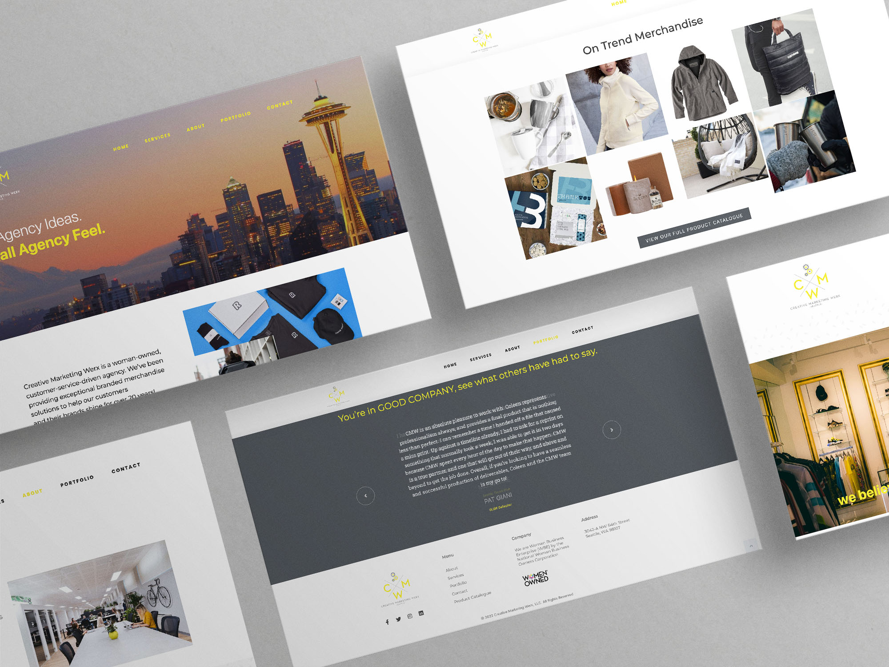

## Context

Creative Marketing Werx is a woman-owned agency that specializes in providing branded merchandise solutions to help their customers' brands shine. With over 20 years of experience, the agency prides itself on delivering exceptional customer service. To enhance their online presence and showcase their expertise, the agency embarked on a website redesign project. This case study highlights the process and outcomes of the website redesign, which was developed using WordPress and a drag-and-drop editor.

### Objective:

The primary objective of the website redesign was to create a modern and user-friendly online platform that effectively communicated Creative Marketing Werx's brand identity and showcased their range of branded merchandise solutions. The secondary objective was to provide the client with an easy-to-use website management system for future updates and additions.

### Design and Development Process:

1. Discovery and Planning:

- Conducted thorough discussions with Creative Marketing Werx to understand their goals, target audience, and design preferences.
- Created a comprehensive project plan, outlining the scope of work, milestones, and deliverables.
- Developed an onboarding guide to gather all the necessary assets and information from the client.

2. Wireframing and Prototyping:

- Created wireframes and interactive prototypes to visualize the website's structure and user flow.
- Collaborated with the client to gather feedback and make necessary adjustments to the design and layout.

3. Design and Customization:

- Utilized Photoshop and Illustrator to create custom digital assets, including high-quality images and graphics that aligned with the agency's brand identity.
- Designed a visually appealing and responsive website layout using the drag-and-drop editor in WordPress.
- Incorporated Creative Marketing Werx's branding elements, such as their logo, color palette, and typography, to ensure consistency across the website.

4. Content Integration and Optimization:

- Collaborated with the client to curate and optimize the website's content, ensuring it effectively communicated the agency's services, expertise, and unique value proposition.
- Implemented search engine optimization (SEO) techniques to enhance the website's visibility and organic search rankings.

5. User Testing and Quality Assurance:

- Conducted thorough testing across multiple devices and browsers to ensure a seamless user experience and proper functionality of the website.
- Addressed any issues or bugs identified during testing, making necessary adjustments and refinements.

6. Training and Handover:

- Provided comprehensive training to the client on how to manage and update the website using the intuitive drag-and-drop editor in WordPress.
- Delivered all project assets, including source files, documentation, and the onboarding guide, to the client for future reference.

### Outcomes and Results:

The website redesign for Creative Marketing Werx successfully achieved the following outcomes:

- Enhanced User Experience: The intuitive and user-friendly design allows visitors to easily navigate through the website, explore the agency's services, and engage with their content.

- Improved Brand Perception: The modern and visually appealing design reflects Creative Marketing Werx's professionalism, expertise, and commitment to customer service, elevating their brand image.

- Increased Conversion Opportunities: The strategically placed call-to-action buttons and optimized content encourage visitors to take desired actions, resulting in improved lead generation and conversion rates.

- Empowered Website Management: The drag-and-drop editor in WordPress enables the client to easily update and expand the website's content without requiring extensive technical knowledge or external assistance.

### View the live project: [creativemarketingwerx.com](https://www.creativemarketingwerx.com/)

## Skills

- WordPress
- Elementor
- SiteGround
- GoDaddy Domain Redirect
