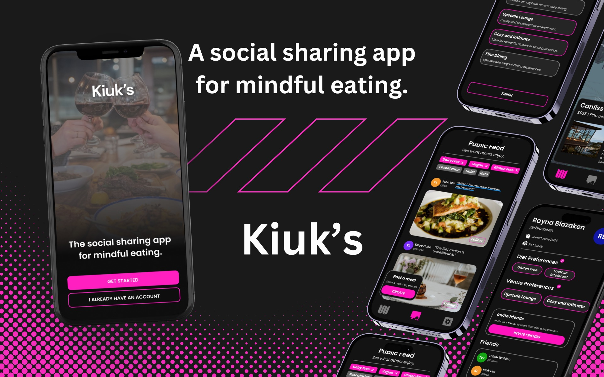

## Summary

> Kiuks: The Social Sharing App for Mindful Eating.

The Kiuks mobile app prototype was created to support users with restrictive diets by helping them discover safe and inclusive dining options. With this app, users can explore and rate restaurants based on specific dietary restrictions, such as allergies or lifestyle choices, ensuring they find suitable meals. The design aims to foster a community of mindful eaters who share recommendations, tips, and experiences, creating a supportive network for those with dietary restrictions.

<!--  -->

### User Stories

**Allergy-Friendly Dining** – Users with food allergies (e.g., peanuts, shellfish, dairy) can rate restaurants on their allergy accommodation practices, including menu options and staff knowledge.

**Keto-Friendly Options** – People following a ketogenic diet can find and review restaurants with low-carb, high-fat menu items that align with keto requirements.

**Pescatarian Preferences** – Users can filter and recommend restaurants that offer high-quality pescatarian-friendly meals, helping others find sustainable and diverse fish options.

**Gluten-Free Dining** – Users with gluten intolerance or Celiac disease can find restaurants with gluten-free menu items and rate the restaurant’s adherence to cross-contamination protocols.

**Vegan and Vegetarian Choices** – Users seeking plant-based options can review and recommend eateries based on the variety and quality of vegan or vegetarian dishes.

### Design Elements

**Clear, Icon-Based Filters** – Filters allow users to quickly search for restaurants based on their dietary preferences (e.g., vegan, keto, gluten-free), each represented by clear, intuitive icons.

**Interactive Rating System** – A ratings system lets users evaluate each restaurant’s dietary accommodations, with criteria like "allergy awareness," "menu variety," and "cross-contamination precautions."

**Social and Follower Features** – Users can follow other like-minded individuals, view their restaurant recommendations, and build a community focused on safe, enjoyable dining.

**Map-Based Restaurant Finder** – A location-based map displays restaurants that meet users’ dietary needs, with color-coded pins indicating restriction types.

The Kiuks app design prioritizes inclusivity, usability, and community support, providing a valuable resource for individuals who need or prefer specific dietary accommodations.

## Skills

- Figma
- Requirements Gathering
- Canva
