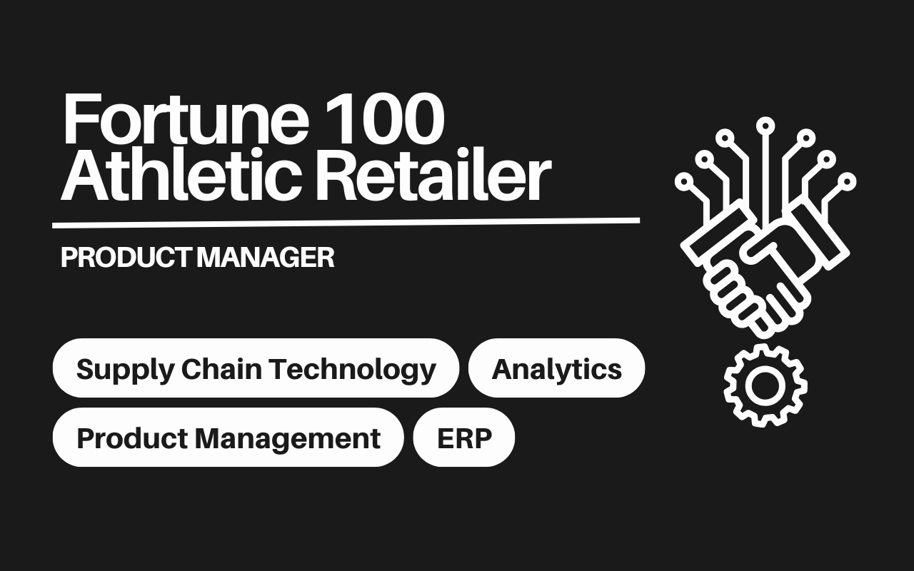

## Summary

My team and I successfully implemented and optimized a modern Enterprise Resource Planning (ERP) system for a global retailer. This 24-month engagement aimed to modernize the ERP and consolidate all geographies onto a global platform, aligning technology with marketplace demands to drive growth, improve profitability, and reduce operational costs. The initiative also strengthened the company's ability to process customer orders and returns efficiently across multiple geographies. 

Through targeted program management, stakeholder change management, and analytics-driven product development, we enhanced  the client's global supply chain technology capabilities, driving seamless ERP adoption and long-term product management maturity.

### Challenge

The client's Supply Chain Technology team operates in a fast-paced, complex environment, managing multiple initiatives simultaneously. Organizational changes, team newness, and varying expertise levels resulted in unclear roles, inconsistent processes, and a lack of historical context for decision-making, slowing momentum during the ERP implementation. The global scope of the ERP rollout, with its cross-functional complexities and time zone differences, further intensified resource constraints and decision-making cycles. To address these challenges, the client sought our team's support to scale capabilities and accelerate delivery.

### Solution

We provided expertise in program management, business analysis, and stakeholder change management to support the global ERP implementation:

- **Change Management and Go-Live Support**: We implemented a comprehensive change management strategy to onboard the North America region onto the Global ERP platform, including solution confirmation, stakeholder engagement, integrated testing, and knowledge transfer to foster user adoption and platform familiarity.

- **Stakeholder Engagement**: In alignment with the change management approach, we facilitated recurring forums such as monthly backlog refinement sessions with business leads from live geographies, providing a structured avenue for capturing pain points, gathering contextual feedback, and aligning on evolving requirements to continuously improve the ERP platform.

- **Data-Driven Product Management**: We drove the adoption of a product analytics platform, enabling real-time visibility into feature adoption, usage trends, and product health without heavily relying on our scarce engineering resources. In tandem, we developed a centralized in-app feedback portal and enhanced stakeholder engagement processes, creating a two-way channel for idea sharing, voting, and discussion. This shifted the organization from a reactive service model to a proactive, product-led approach, strengthening backlog management and enabling high-impact, user-centered enhancements.

- **User Feedback and Measurement**: We implemented a Net Promoter Score (NPS) framework for over 3,000 internal business users, segmenting the feedback by persona and revenue contribution. This enabled leaders to prioritize high-impact enhancements and track adoption and satisfaction over time.

- **Continuous Product Improvement**: We established a structured backlog refinement process to bridge the gap between engineering and business stakeholders, enabling stakeholders to surface pain points, clarify requirements, and provide business context. This improved prioritization, ensured actionable ideas, and strengthened alignment between engineering and business.

### Results

By aligning technology with marketplace demands, my team and I successfully drove growth in market share, enhanced profitability, and reduced operational costs. The engagement delivered measurable, impactful outcomes for our client:

- **Strategic Growth Enablement**: Supported immediate ERP implementation goals and contributed to the client's long-term roadmap, reinforcing operational resilience and product management maturity.

- **Enhanced Operational Efficiency**: Leveraged analytics to reduce dependency on engineers for system performance metrics, freeing up resources for higher-priority development work. New capabilities such as tracking feature adoption and measuring KPIs by business segment enabled precise, data-informed analysis.

- **Improved User Experience**: Developed a centralized in-app feedback portal and enhanced stakeholder engagement processes, shifting the client from a reactive service model to a proactive, product-led approach. This empowered product managers to drive prioritization and road mapping efforts in alignment with business input.

### Client Testimonials

>“Thank you for your AMAZING support. You helped ensure the release was on track from start until finish. It was critical to have your full technical expertise during planning and super important to keep the deployment effective as we ramped down and ramped up the systems in scope. As opportunities and challenges were identified during execution, we made it to the finish line successfully. Truly appreciate your dedication and commitment.” 
> 
> – Senior Enterprise Manager 

>“Huge thank you for staging hundreds of cases for 100+ end users for training. No one else has successfully staged errors for end users to resolve! This is a huge advancement in the experience we can offer end users, and their preparedness for go-live. Your work directly supports business readiness!”
> 
> – Transformational Change Lead

## Skills

- SAP S4 Hana
- Postman
- Pendo
- Change Management