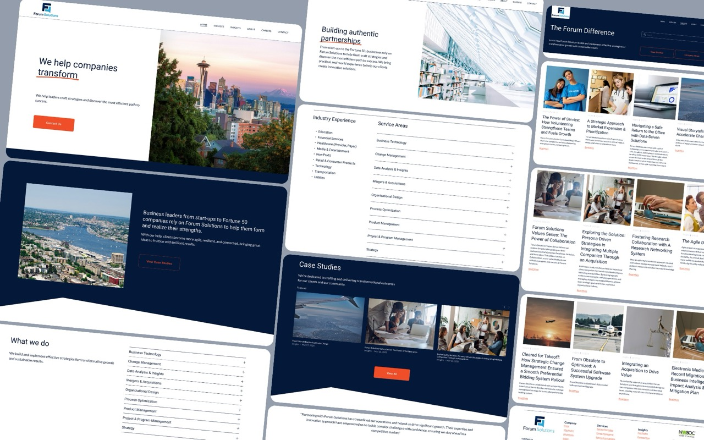
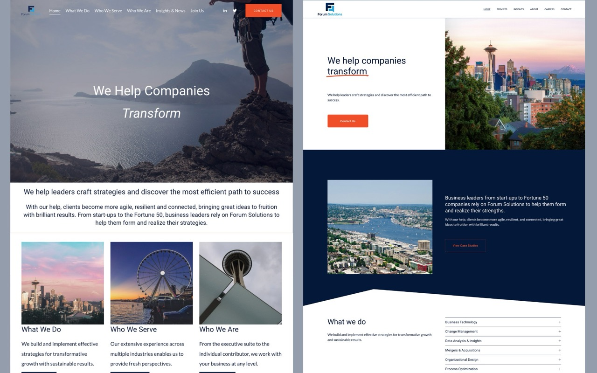
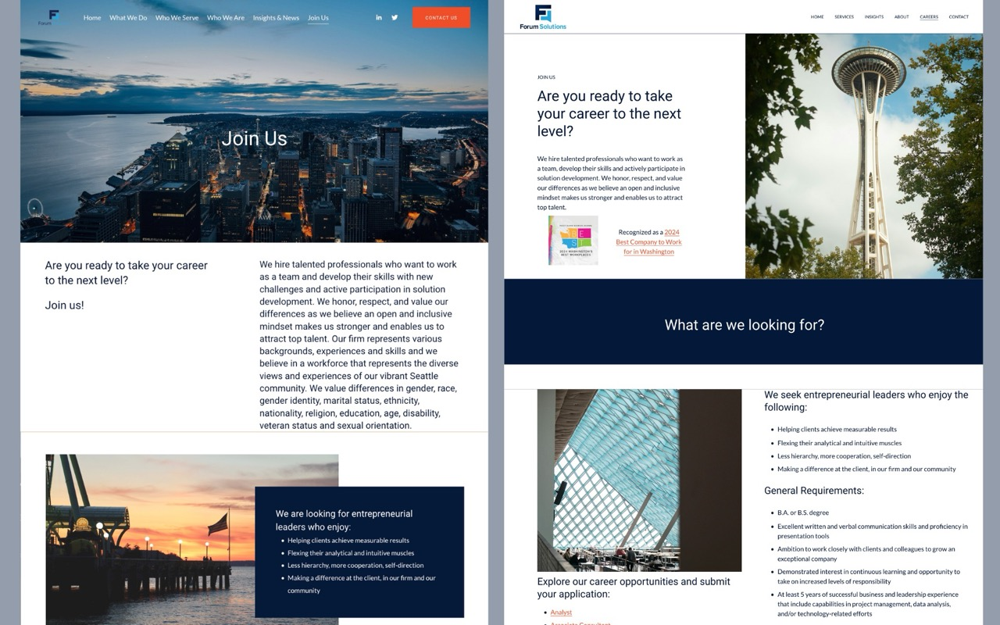
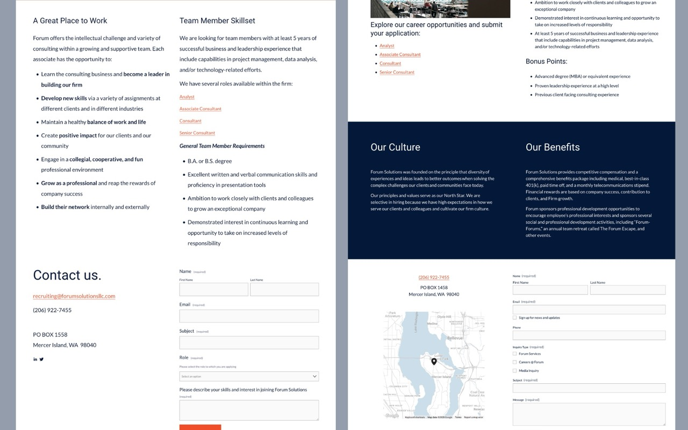

## Summary

[Forum Solutions](https://forumsolutionsllc.com), a boutique consulting firm, needed a refreshed digital presence to better reflect their expertise and company story. The original website design was outdated, with inconsistent image usage, poor scaling, and a lack of clear visual hierarchy. The goal of the project was to modernize the site while respecting the existing brand guidelines.

> Improved visual hierarchy by introducing strategic accent colors for CTAs and curated cohesive imagery to better align with the company’s story and values.

### Scope

Led the full redesign of Forum Solutions’ Squarespace website, focusing on enhancing the user experience, optimizing site performance, and aligning the visual identity with the firm's professional brand. 

### Design

- • Maintained the original color palette, introducing a structured hierarchy to highlight key CTAs using brighter accent colors for improved user flow and engagement.

- • Optimized and replaced images to ensure consistency, better performance, and stronger storytelling aligned with the firm's messaging.

- • Refined layouts for clarity, accessibility, and responsiveness across devices, improving both aesthetics and functionality without disrupting the firm's established brand.

## Skills

- Squarespace
- Canva