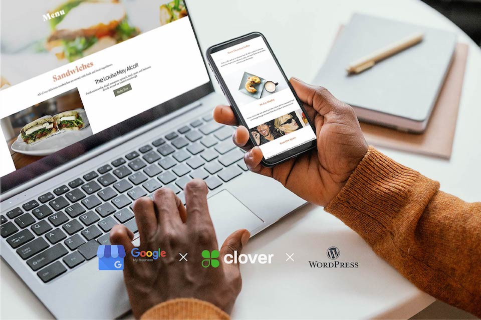
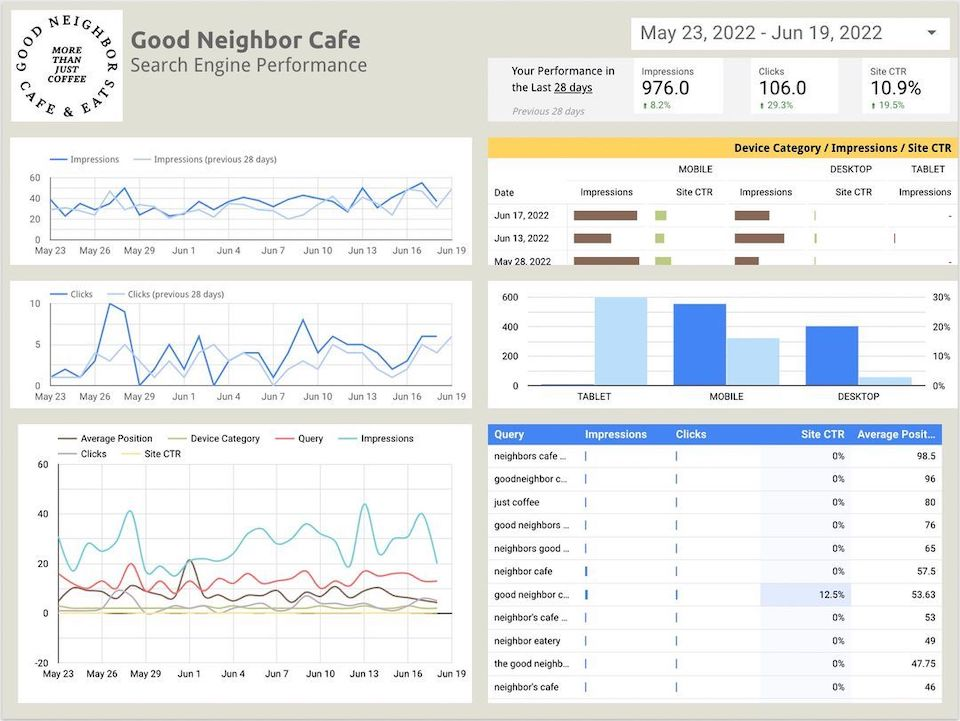

## Context

A local cafe needed a way to reach more customers and easily allow for people to order online.

> More than just coffee.

I was proud to manage the project with Good Neighbor Cafe on the development of their digital storefront. I was excited to take on this project for a woman-owned small business that operates a cafe in the Capitol Hill neighborhood. Following the initial consultation with the client, I proposed a WordPress website that integrated the existing Point-of-Sale system [Clover](https://www.clover.com/) with an online ordering capability.

The team also created custom content (digital assets), as well as a Google My Business (GMB) integration to increase site exposure. I continue to work with Good Neighbor Cafe as their primary web and digital consultant.

### View the live project: [goodneighboreats.com](https://www.goodneighboreats.com/)

I added Google Analytics to the site and connected the data to Google Data Studio, where I build a custom performance report so the cafe owner could easily track the business's online conversions and web traffic. It enables them to quickly understand how effective their digital marketing ads are working on a bi-weekly and monthly basis.

## Skills

- WordPress
- Elementor
- SiteGround
- Google Analytics (Pay-Per-Click)
- Google Search Console (Search Engine Performance)
- Google Data Studio
- Google Business Manager
