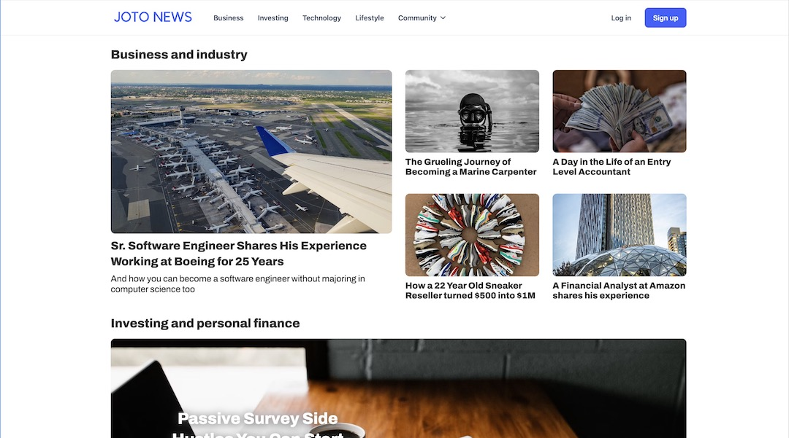

## Context

Welcome to Joto News, your trusted source for real stories that resonate with your personal and professional life. Our mission is to provide you with the latest news and insights on business, career advice, personal finance, and lifestyle. Cut through the noise with our thought-provoking and well-researched content, delivering smart analysis of the global economy. We pride ourselves on showcasing diverse voices and perspectives through real stories by real people, offering a glimpse into inspiring lives and a better understanding of the world.

### Objective:

Our mission is to provide you with the latest news and insights on business, career advice, personal finance, and lifestyle. We understand that the world is constantly evolving, and it's essential to stay informed about the trends, challenges, and opportunities that shape our lives.

### Design and Development Process:

1. Discovery and Planning:

- Created a comprehensive project plan, outlining the scope of work, milestones, and deliverables.

2. Wireframing and Prototyping:

- Created wireframes and interactive prototypes to visualize the website's structure and user flow.

3. Design and Customization:

- Utilized Photoshop and Illustrator to create custom digital assets, including high-quality images and graphics that aligned with Joto News identity.
- Incorporated Joto New's branding elements, such as the logo, color palette, and typography, to ensure consistency across the website.

4. Content Integration and Optimization:

- Implemented search engine optimization (SEO) techniques to enhance the website's visibility and organic search rankings.

### The site is no longer live

## Skills

- Webflow
- Google Analytics
- Email Marketing
- Hot Jar Analytics
- ChatGPT
- MidJourney
