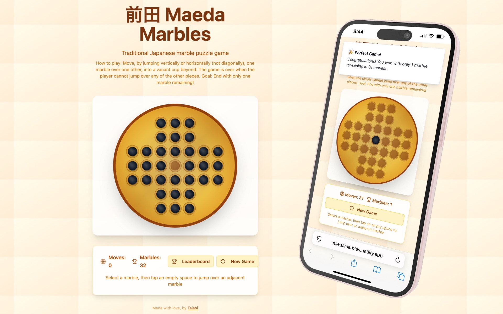
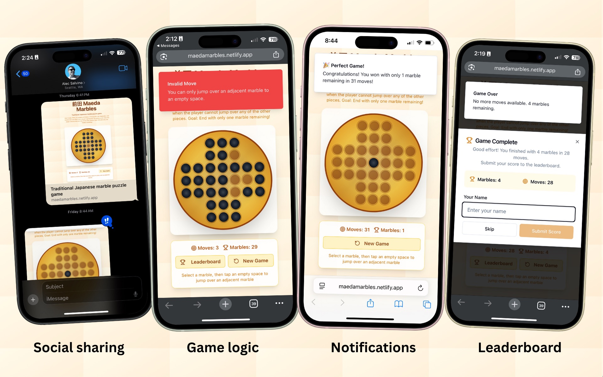
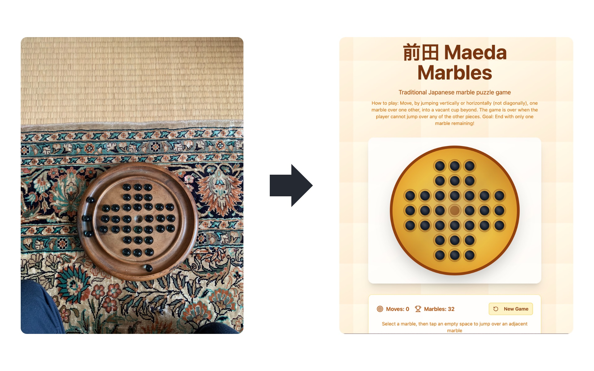
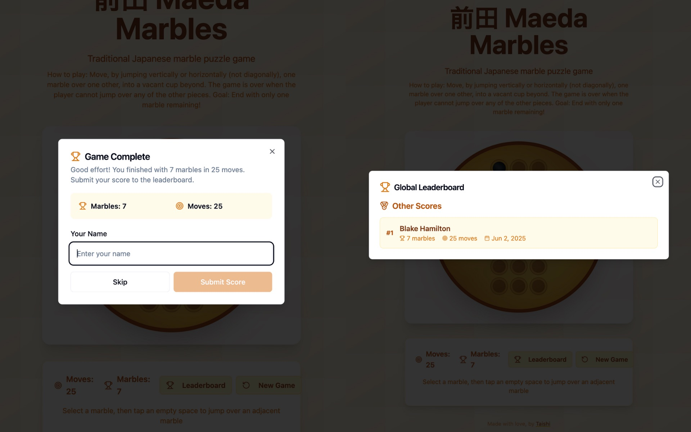

### View the live project: [maedamarbles.netlify.app](https://maedamarbles.netlify.app/)

## Summary

[Maeda Marbles]((https://maedamarbles.netlify.app/)) is a web-based version of a traditional Japanese marble puzzle game I played growing up. The physical set I used to own was left behind in Japan, so I set out to recreate the experience digitally — making it accessible to anyone, anywhere. Built using Lovable.Dev, a natural language-to-code platform, this project blends childhood nostalgia with modern web development and prompt-based programming.

## How to Play

- • Move a marble by jumping it vertically or horizontally over one adjacent marble into an empty cup.

- • The jumped-over marble is removed.

- • Continue jumping marbles until no more valid moves remain.

- • 🎯 Goal: End the game with only one marble left on the board.

## Why I Built It
This game was a core memory from my childhood in Japan. I wanted to preserve and share that tactile, meditative experience online — both as a personal keepsake and as a tribute to the simplicity of traditional Japanese puzzles.

### The Build Process:
The development process started with a photo of my original game set, followed by a detailed prompt explaining the rules. Within a few iterations, Lovable.Dev generated a functional prototype. From there, I refined it by:
- • Fine-tuning layout and component spacing for responsiveness

- • Integrating a leaderboard using browser-based LocalStorage

- • Adding gentle UI sounds for a satisfying game experience

Currently, the leaderboard is not connected to a backend - it's only stored locally in each user's browser using localStorage. This means:

* • Each user only sees their own scores

* • Scores are not shared between different users/devices

* • Data is lost if the user clears their browser data

## What I Learned
Recreating Maeda Marbles taught me how to translate physical experiences into digital logic through natural language prompting. By breaking down the game's rules into clear, structured prompts, I was able to guide Lovable.Dev toward generating functional and accurate code. This process reinforced the importance of clarity, iteration, and creative problem-solving when working with AI-assisted development tools. 

I also gained a deeper appreciation for the subtle elements of game design — how layout, sound, and feedback can elevate a simple mechanic into something engaging and memorable. Balancing the nostalgia of a childhood game with the expectations of modern web users pushed me to consider not just how the game worked, but how it felt to play.

## Skills

- Lovable.Dev
- Netlify
