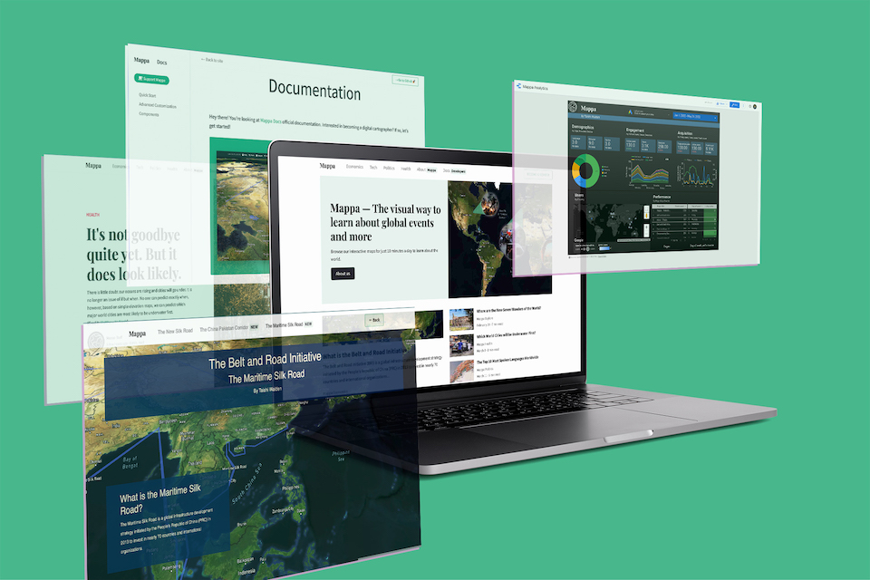
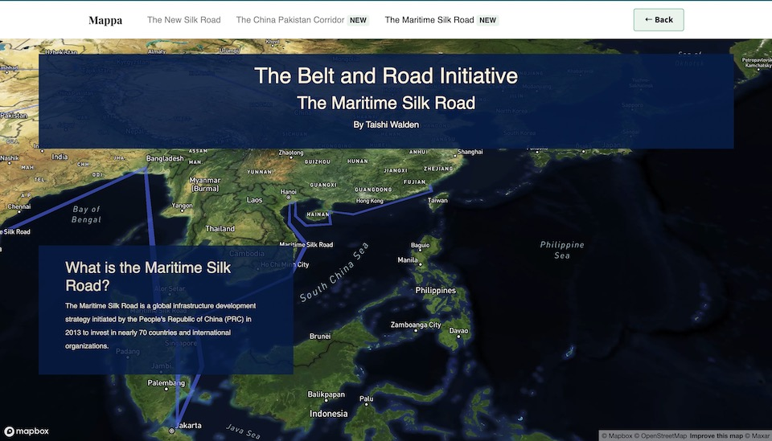
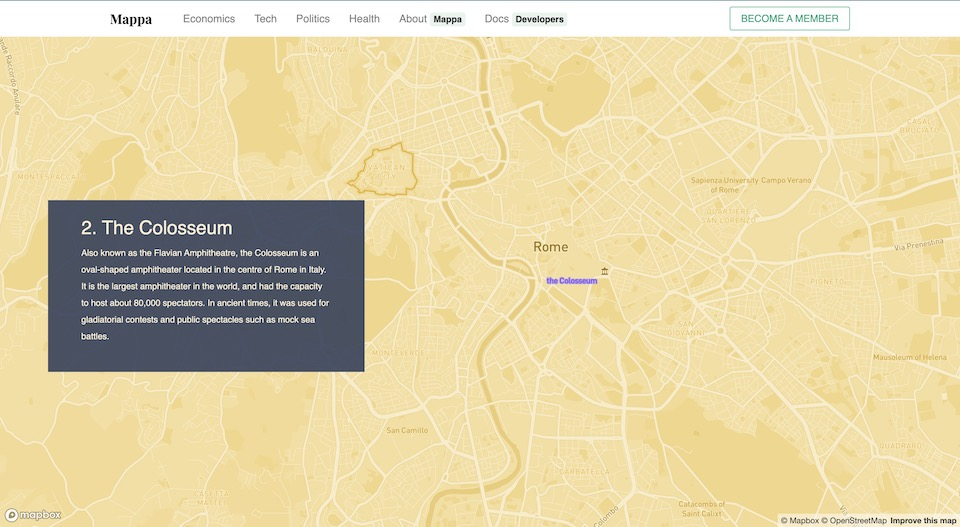
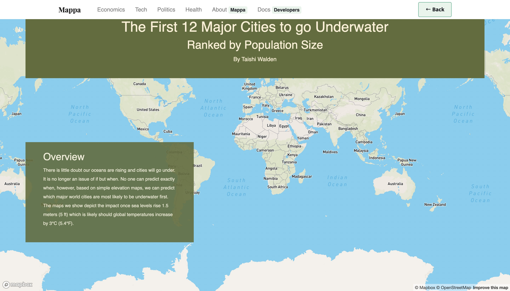
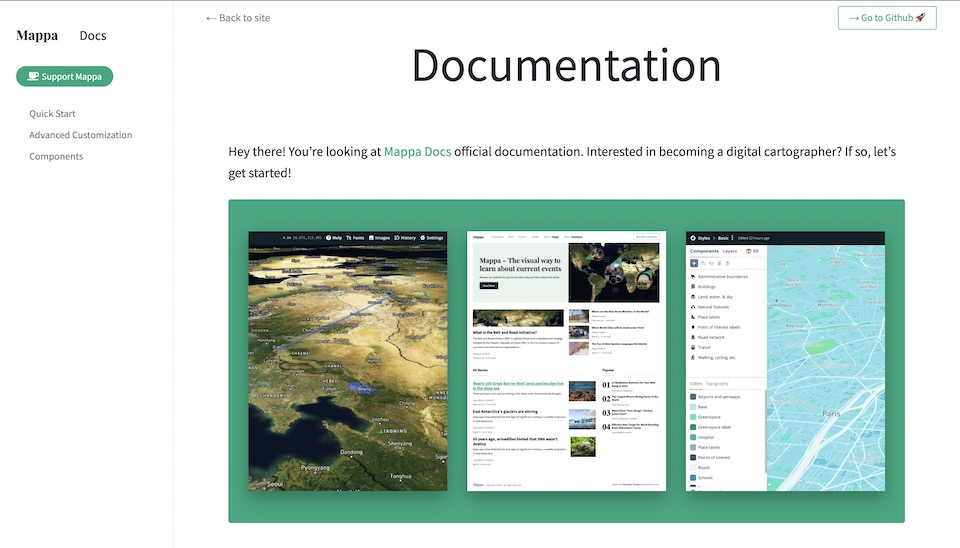
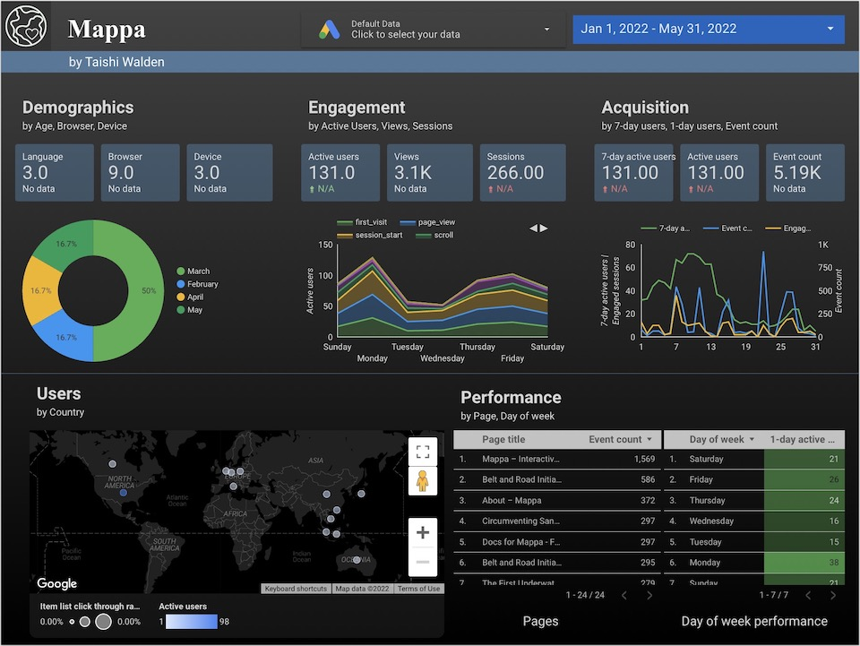

## View the live project: [Mappa News](https://mappanews.netlify.app/)

## Summary

According to [Learning Theory Research](https://papers.ssrn.com/sol3/papers.cfm?abstract_id=587201), nearly **65% of the general population are visual learners**, meaning they need to see information in order to retain it.

This prompted the creation of [Mappa](https://mappanews.netlify.app/about): utilizing graphs, charts, maps, and other forms of visual stimulation to effectively illustrate current events and global news. To stand up a minimum viable product for my _"million dollar idea"_, I deduced it would be the most efficient to use HTML, CSS, and Vanilla JavaScript to create the blog, and utilize existing JavaScript Libraries like [MapBox GL JS](https://docs.mapbox.com/mapbox-gl-js/guides/).

> "Mapbox GL JS is a client-side JavaScript library for building web maps and web applications with Mapbox's modern mapping technology. You can use Mapbox GL JS to display Mapbox maps in a web browser or client, add user interactivity, and customize the map experience in your application."

### Featured Articles

> China’s President Xi Jinping unveiled The Initiative in 2013, and it is often referred to as one of the most ambitious infrastructure projects ever conceived.. [View the BRI article here](https://mappanews.netlify.app/belt-and-road-initiative).

> Given that the original Seven Wonders list was compiled in the 2nd century BCE, it seemed time for an update. [View the 7 World Wonders article here](https://mappanews.netlify.app/seven-world-wonders).

> There is little doubt our oceans are rising and cities will go under. It is no longer an issue of if but when. [View the Underwater Cities article here](https://mappanews.netlify.app/underwater-cities).

### Documentation

Although Mappa was initially built with the idea of giving visual learners more exposure to international relations and global politics, I developed a documentation page so that people could create interactive maps for other purposes–like mapping their study abroad program or travel plans.

### Analytics

To measure the popularity of the project, I used **Google Analytics** to track web traffic, average time spent on the page, number of active users, as well as other key digital marketing indicators. I built a dashboard on **Google Data Studio** to allow for easy interpretation.

## Skills

- HTML, CSS, JavaScript
- Mapbox Studio
- Mapbox GL JS
- Netlify
- Google Analytics
