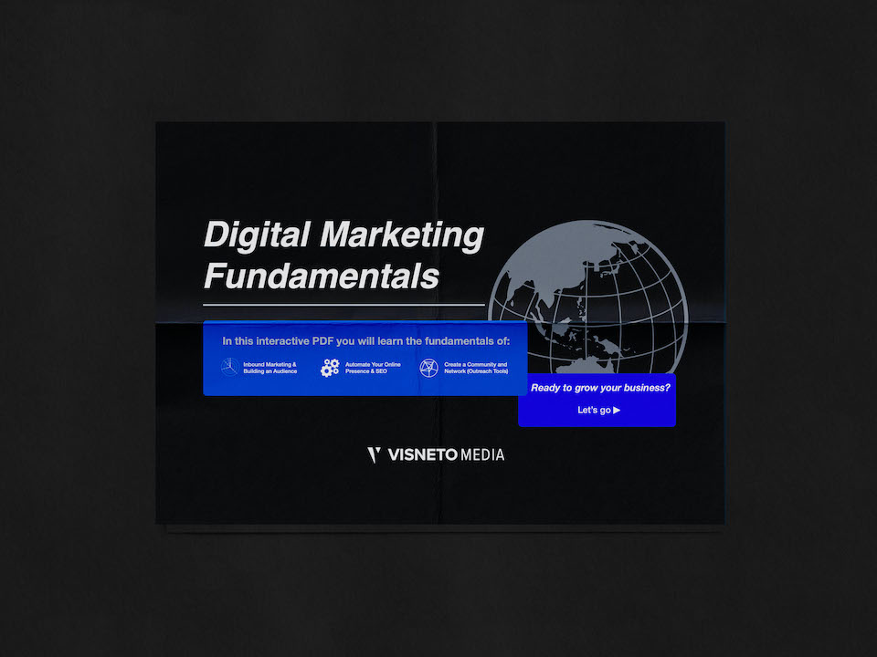
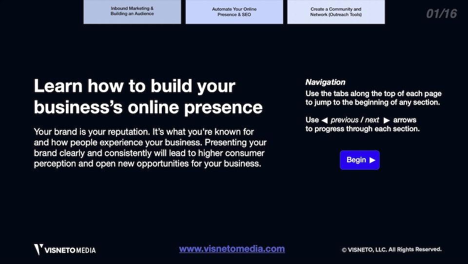
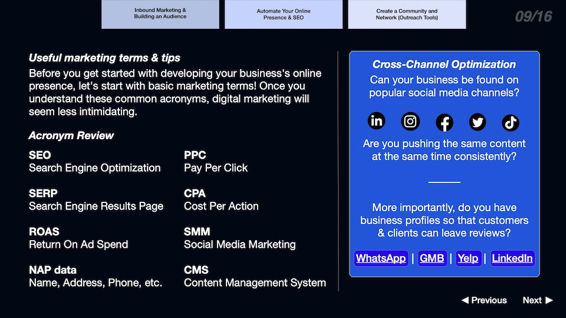
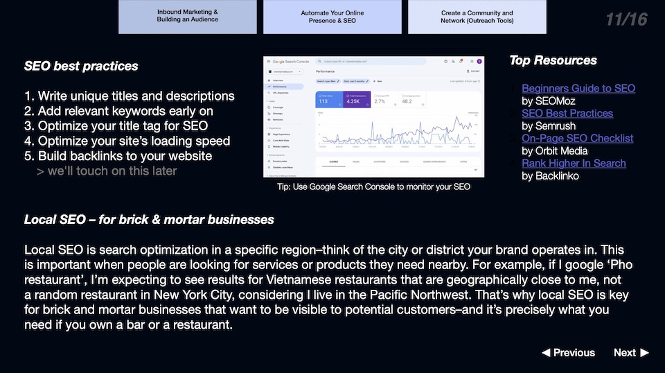
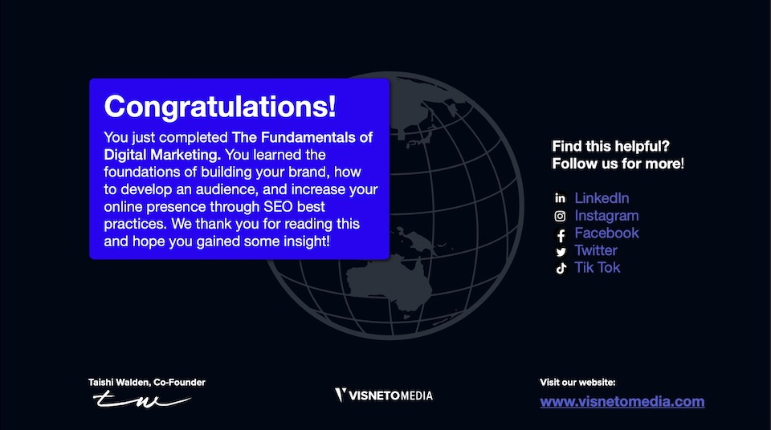
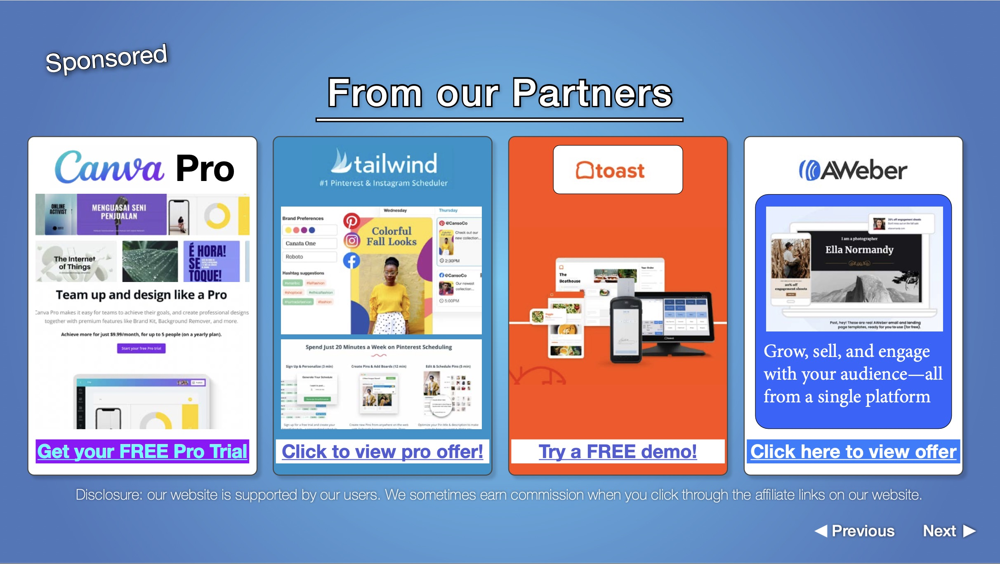

## Context

After getting certified in: Google Digital Marketing & SEO, Hubspot Inbound Marketing, Advanced Google Analytics, and Facebook Social Media Ads, I decided to compile my knowledge on digital marketing into an "easy-to-digest" document. This marketing asset was used in the inbound marketing campaign for [Visneto](https://visneto.webflow.io), allowing people to download the document by entering their email.

The interactive PDF included the following topics:

### Inbound Marketing & Building an Audience

> When it comes to long-term business development strategies, inbound marketing is an investment that will boost your brand awareness, consumer preference, and revenue. Sounds great doesn't it? Well, although inbound marketing seems like a no-brainer to incorporate in your business strategy, it must be expressed that it takes time.
> In simple terms, inbound marketing is the process in which customers find your business organically. It's attractive to customers because they don't feel like their being sold to and the content provided by inbound marketing can be educational, entertaining, and overall helpful to customers.

### Automate your Online Presence & SEO Best Practices

> Local SEO is search optimization in a specific region–think of the city or district your brand operates in. This is important when people are looking for services or products they need nearby. For example, if I google ‘Pho restaurant’, I’m expecting to see results for Vietnamese restaurants that are geographically close to me, not
> a random restaurant in New York City, considering I live in the Pacific Northwest. That’s why local SEO is key for brick and mortar businesses that want to be visible to potential customers–and it’s precisely what you need if you own a bar or a restaurant.

### Outreach and Creating Community with your Brand

> Outreach doesn't always pertain to finding new clients and customers. Outreach programs often vary between different organizations, but they all involve the opportunity to add significant value to your brand.
> Depending on your business' goals, strategy can be attending local events, networking events, business expos, etc.
> The goal is to start making yourself and your business a known part of the local business community. Get to know your fellow business owners and potential clients.

## Here is the full PDF: <a href="./images/marketing-pdf/Visneto_Marketing_Guide_2021.pdf">Click to download the PDF</a>

### Affiliate Links

As part of the inbound campaign, the team applied to **affiliate partnerships** with the Saas (Software as a Service) companies mentioned and created a slide within the PDF with the affiliate links to earn commission on readers that signed up using our digital asset as a funnel.

## Skills

- Adobe Indesign
- Adobe Illustrator
- Adobe Photoshop
- Digital Marketing
- Social Media Marketing
