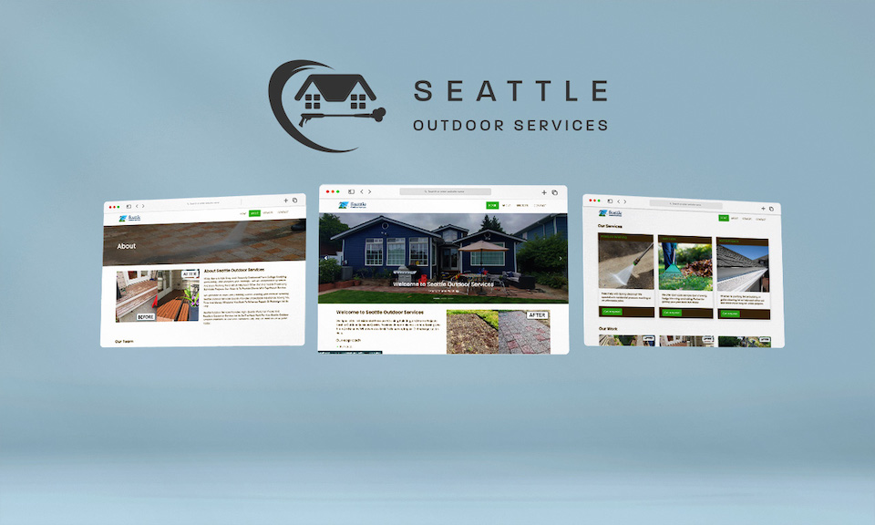
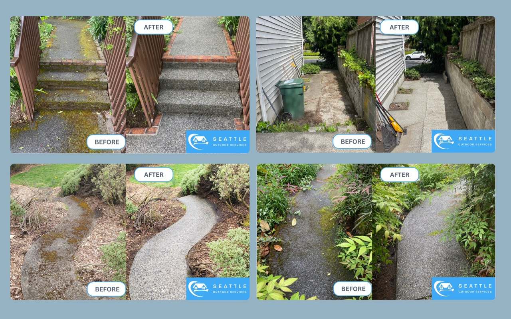
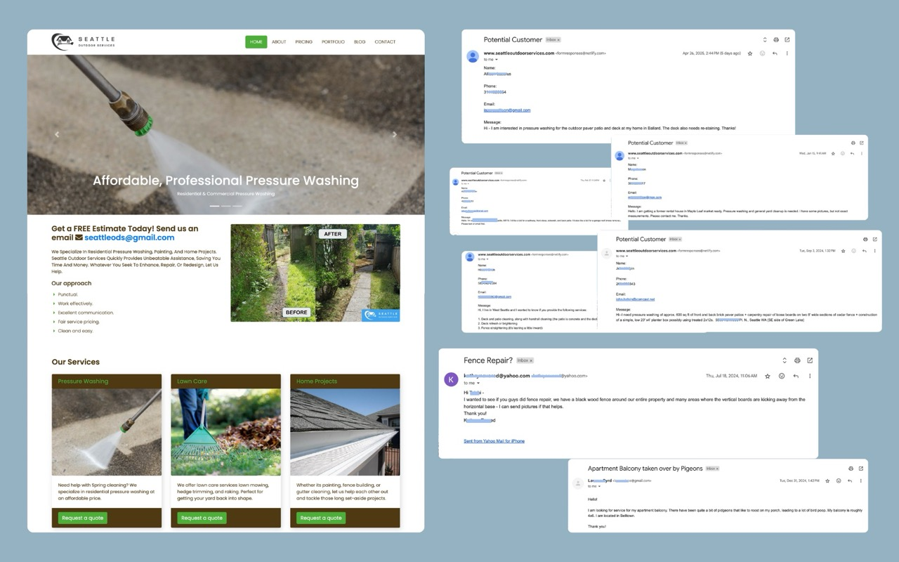

### View the live project: [seattleoutdoorservices.com](https://www.seattleoutdoorservices.com/)

## Summary

Seattle Outdoor Services is a premier provider of power washing, landscaping, and home improvement services and serves the local Seattle area. I worked directly with the owner, [Kyle Gray](https://www.linkedin.com/in/kyleandrewgray/), to design and develop a site that best represented their brand, mission, and business.

> Whatever you seek to enhance, repair, or redesign, let us help.

After discussing his goals for Seattle Outdoor Services's online presence, I determined the best solution for creating the website would be to code the website in HTML, CSS, and JS, and host it on [Netlify](https://www.netlify.com/) to minimize costs - it has a generous free tier. Additionally, I designed branded "before-and-after" images using Canva to illustrate the value of their previous work to prospective customers. 

I built a 5-page marketing website consisting of a home, about, services, blog, and contact page and connected the [github repository](https://github.com/taishiwalden/seattle-outdoor-services) to Netlify for continuous deployment. I implemented Google Analytics tracking code and built a Data Studio Dashboard to interpret website performance in a simple way.

For streamlining online customer communications, I integrated the contact form with Seattle Outdoor Services' Slack workspace, so the team receives mobile push notifications and enables them to respond quicker. The Netlify form is set up to send messages to the business's email, further consolidating the way they can respond to customer inquiries. 

## Skills

- HTML
- CSS (Bootstrap)
- JavaScript
- Netlify
- Google Analytics
- Google Data Studio
