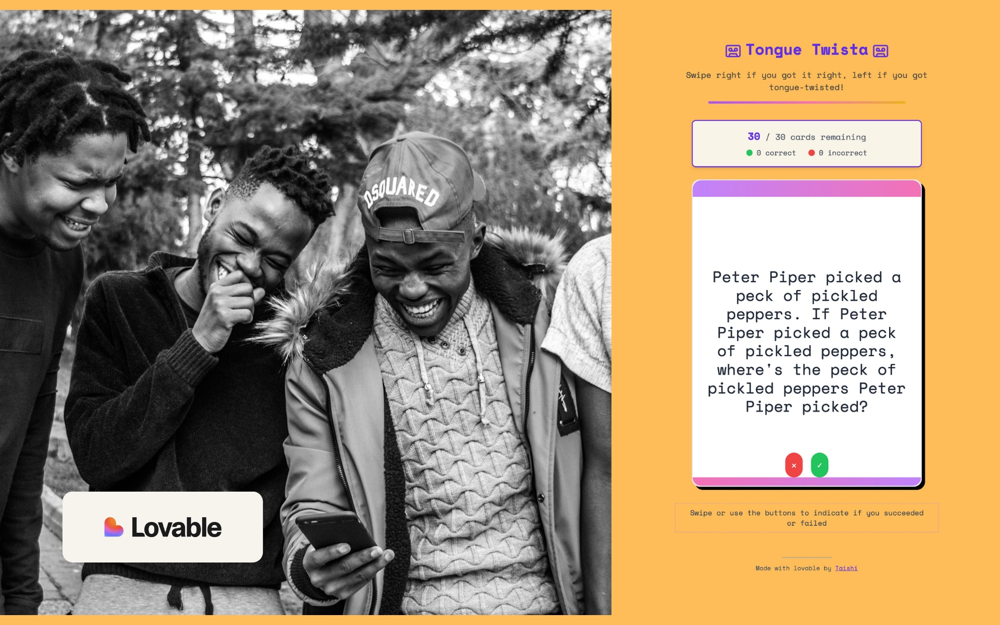
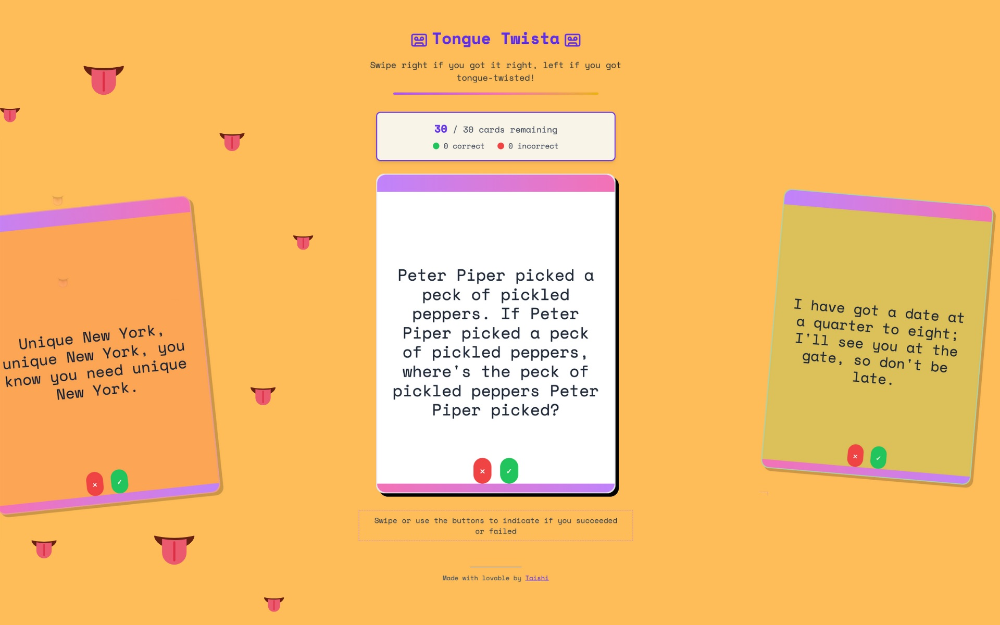
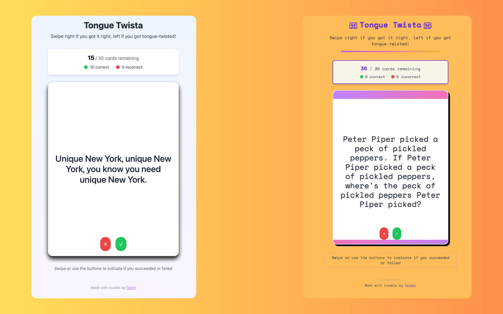

### View the live project: [tonguetwista.netlify.app](https://tonguetwista.netlify.app/)

## Summary

[Tongue Twista](https://tonguetwista.netlify.app/) is a fast-paced web game I built in just a few hours using Lovable.Dev — a platform for rapidly building small creative projects with minimal code overhead. The game is a randomized deck of 30 cards, each featuring a different tongue twister. Users swipe right (or tap the green button) if they pronounce the phrase correctly, or swipe left (red button) if they stumble over the words — keeping score as they go.

## Key Features

- 🎴 Randomized deck of 30 tongue twister cards
- 👆 Swipe-based or button-based input (mobile- and desktop-friendly)
- 📼 Retro-inspired interface for a nostalgic vibe
- 📊 Live score tracking (Correct vs. Tongue Twisted)
- 📤 Shareable results screen to encourage friendly competition

## Why I Built It
This project was an experiment in "vibe coding" — building something fun, fast, and functional without overengineering. I wanted to show how accessible and satisfying it can be to bring a playful concept to life quickly using modern tools.

## What I Learned

* • Leveraged Lovable.Dev for rapid prototyping and design
* • Focused on UX through swipe gestures and visual feedback
* • Explored social mechanics through shareable scores
* • Even simple web games can delight users and inspire competition

## Skills

- Lovable.Dev
- Netlify
