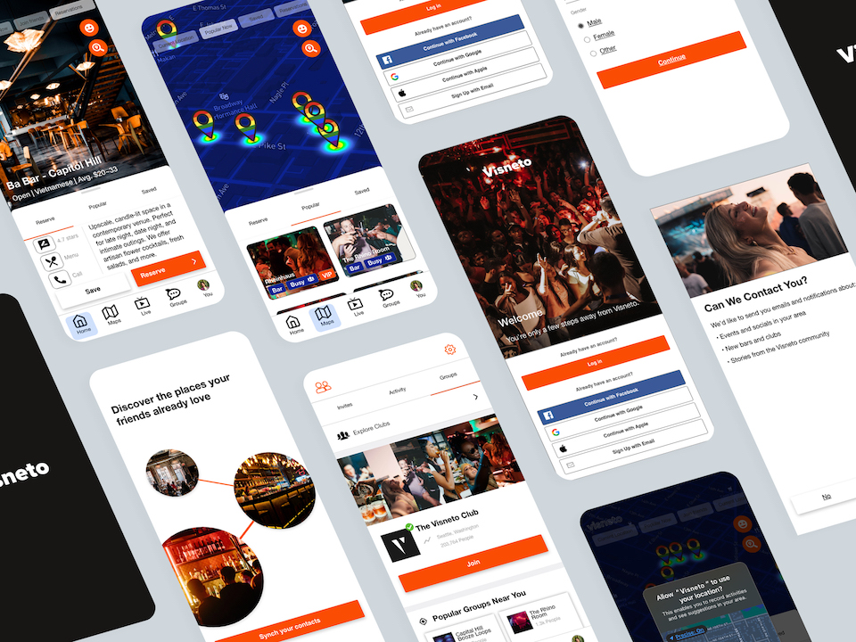
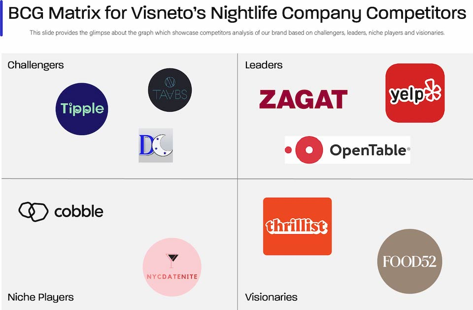

## Context

I designed a startup with the idea of simplifying nightlife. After conducting market research on the competitive landscape, I determined there was an opportunity for market entry. Click to [view the competitive research document](https://docs.google.com/document/d/13YnPX6wSgrjIdE4Fig8tTYTOWOQOVVJAI6RuyzcWJNI/edit?usp=sharing).

> Nightlife made simple. Discover scenes in your area and connect with friends.

Once identifying the leaders, challengers, niche players, and visionaries in the industry, I began compiling data on strengths, weaknesses, and features to help direct the product design.

## Skills

- Figma
- Adobe XD
- Adobe Illustrator
