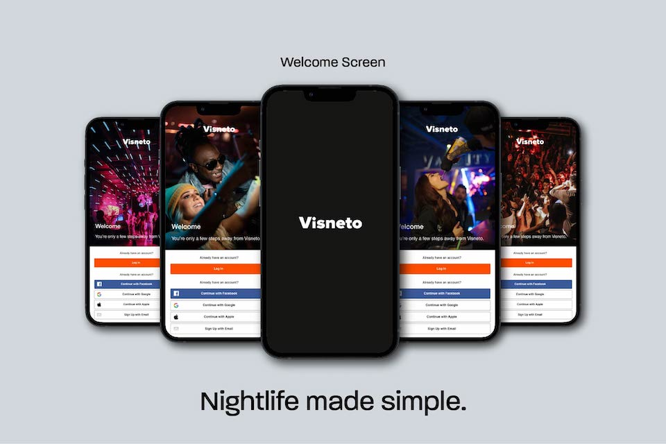
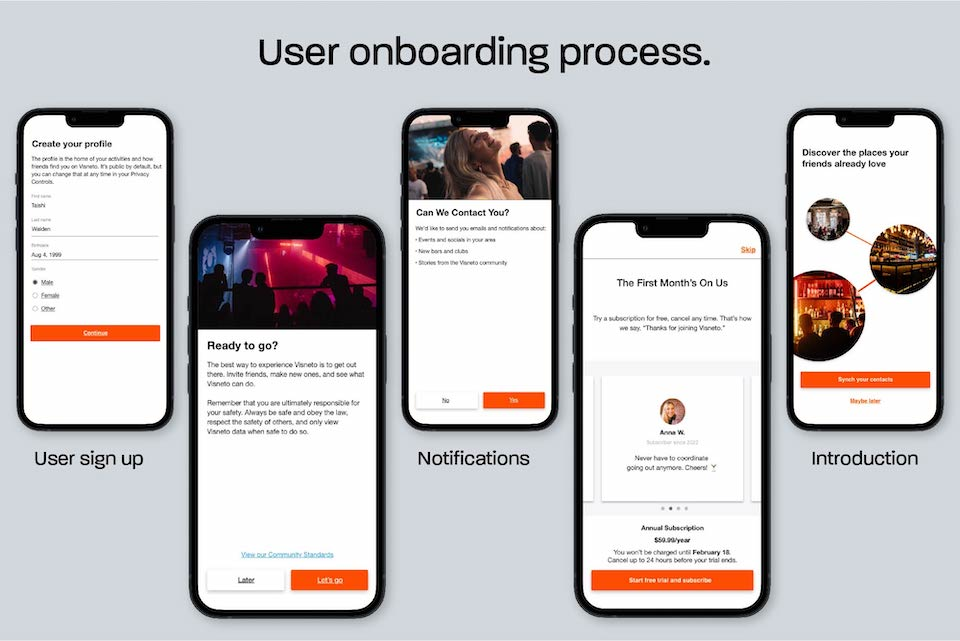
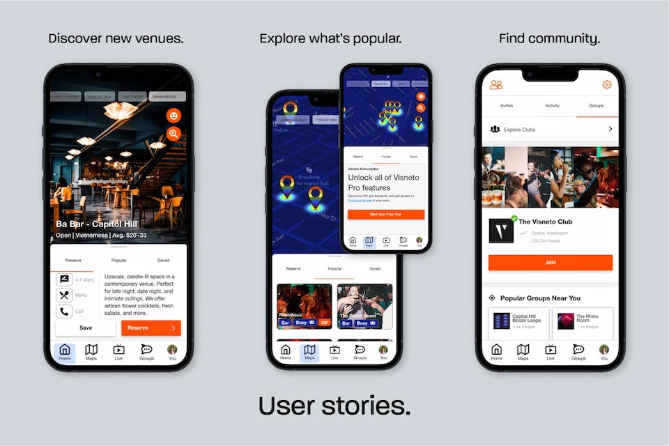

## Context

I designed a startup (with a team of 4) with the idea of simplifying nightlife. After conducting market research on the competitive landscape, we determined there was an opportunity for market entry. Click to [view the competitive research document](https://docs.google.com/document/d/13YnPX6wSgrjIdE4Fig8tTYTOWOQOVVJAI6RuyzcWJNI/edit?usp=sharing).

> Nightlife made simple. Discover scenes in your area and connect with friends.

Once identifying the leaders, challengers, niche players, and visionaries in the industry, I began compiling data on strengths, weaknesses, and features to help direct the product design.

### User Welcome

> "Visneto" means "Venues" in Latin.

The welcome screens encapsulate the idea behind the startup-connecting young people with live music, bars, late-night eateries, and other vibrant scenes. Due to the social nature of the app, we decided it would be best to allow log in integration with popular social media and [Google One Tap](https://developers.google.com/identity/gsi/web/guides/overview).

### User Onboarding

> Discover the places your friends already love.

The onboarding mockup demonstrates what is achievable with the new nightlife application. You can create an account, get notified about local events, special discounts, join community chats, and find venues your friends swear by.

### User Stories

> Discover new venues. Explore what's popular. Find community.

The three core features of the Visneto app were inspired by **Yelp**, **Snapchat**, **Thrillist**, and **Strava**. You can view venue profiles and learn about the menu, prices, location, and atmosphere with additional information provided by other users. If you're out-on-the-town, you can view the heatmap of popular venues in "real-time". Lastly, the key feature is the ability to create community chats revolving on specific events and meetups.

## Skills

- Figma
- Adobe XD
- Adobe Illustrator
