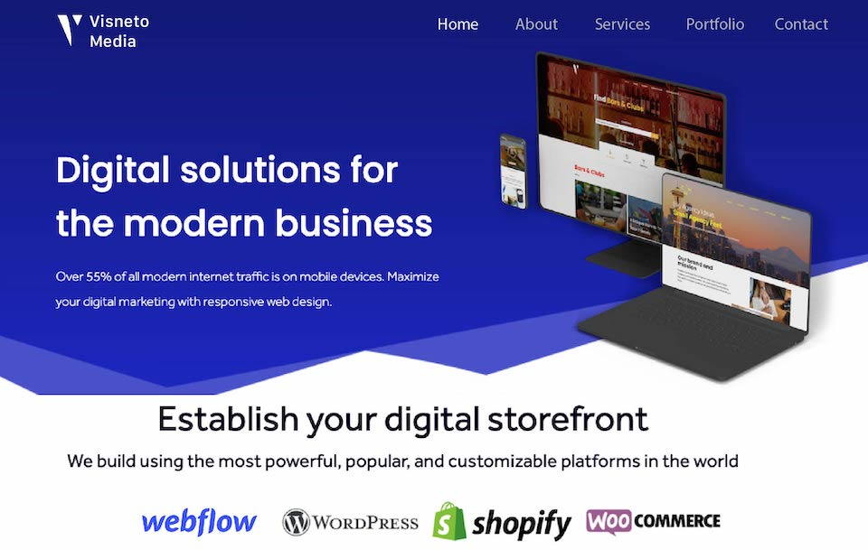

### View the live project: [Visneto | Web Design & Development](https://visneto.webflow.io/)

## Summary

My web design agency's website was initially build using WordPress, however after learning about various CMS development platforms, I was intrigued by one in particular called [Webflow](https://webflow.com/). WordPress's extensive need for plugins and maintenance time pushed me to explore different options with more design freedom.

I used this opportunity to migrate my web design's company website to a webflow - which also boasts powerful CMS and hosting features that WordPress has. Hosting our website on Webflow removed the requirement for monthly maintenance retainers that were associated with our old Wordpress site. In addition, it has more native SEO tools to make adjustments on pages/images/assets which makes it really convenient.

Not to mention, the old website lacked an aesthetic design and semantic layout necessary for a proper landing page. While it adhered to traditional website structure, it was time for a revamp.

### Screenshot of the old site

## Task

Rebuilding a company website is no easy task, especially if you want to modify your brand messaging and create new digital assets. To start, we exported all of the appropriate text onto a document and began compiling our edits on the copy text. After defining the requirements for the new site's landing page and content, I created a basic layout of the website and redesigned it according to the [company colors](https://coolors.co/000814-2d00f7-0056e0-fafaff).

## Skills

- Project Management
- Web Development
- WordPress
- Webflow
- Adobe Illustrator
- Adobe Photoshop
