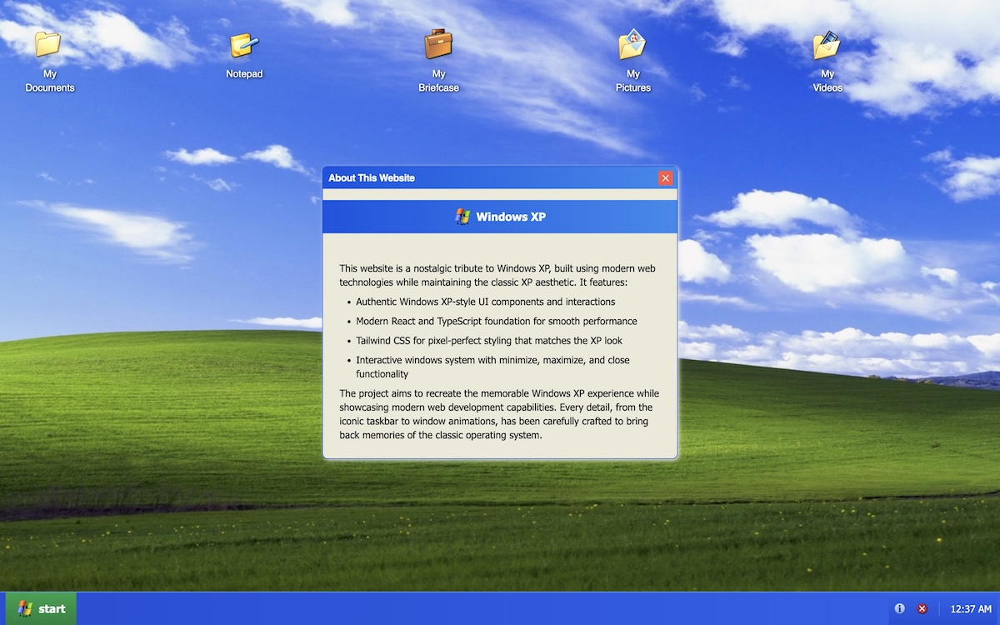
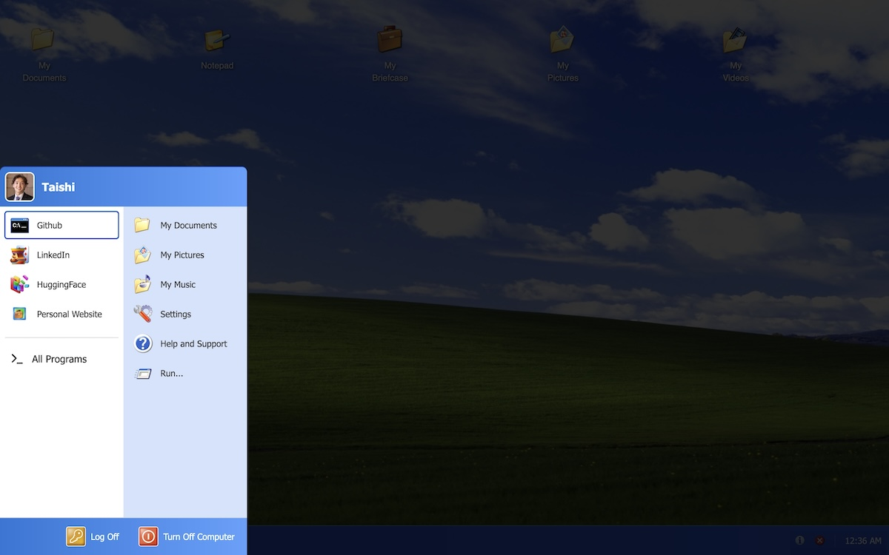
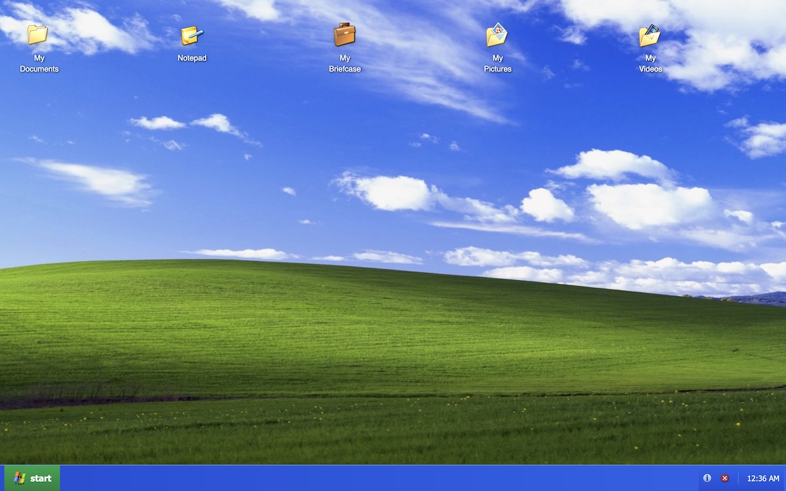
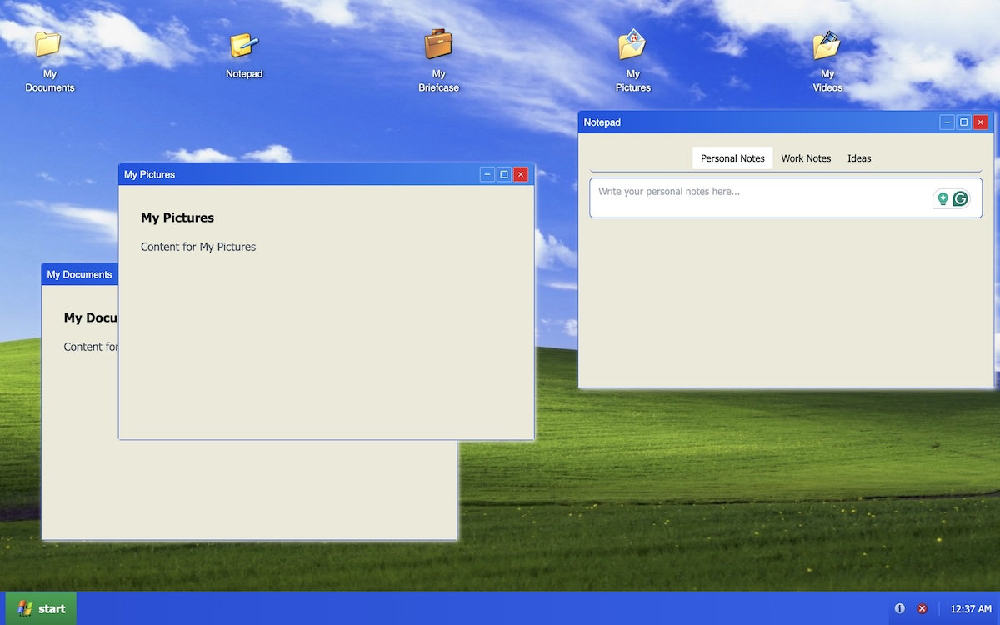
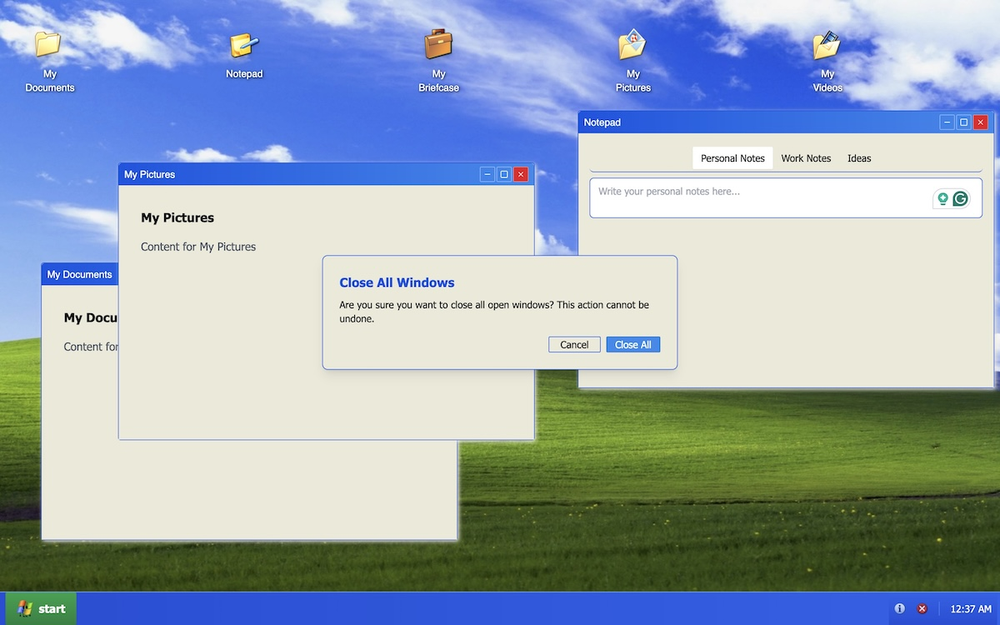

### View the live project: [iconxp.netlify.app](https://iconxp.netlify.app/)

## Summary

This project is a faithful, interactive tribute to the Windows XP interface — the first operating system I ever used, and a nostalgic cornerstone of early computing for many. Recreated using modern web technologies, it captures the look, feel, and behavior of XP's iconic design, all built through carefully crafted prompts using Lovable.Dev, a prompt-to-code development platform.

Windows XP shaped how I first understood computers, and I’ve always loved its playful yet functional UI. I wanted to see if I could bring that experience back using today’s web stack — not by hand-coding from scratch, but by exploring how far intentional prompt design could take me. This was a creative and technical experiment in guiding an AI coding assistant to produce a polished, complex interface.

## Key Features

- 🖥 Authentic Windows XP components: taskbar, Start menu, desktop windows, and draggable UI
- 🔁 Window system with working minimize, maximize, and close functions
- ⚛️ Built on a React + TypeScript foundation for performance and scalability
- 🎨 Tailwind CSS for detailed, pixel-level control over styling
- 💡 All code generated through guided prompt engineering using Lovable.Dev

## Prompt Engineering

Rather than writing each component by hand, I used Lovable.Dev to generate functional UI pieces by iterating on carefully structured prompts. I guided the AI through:

- • Component-level design (e.g. “Create a draggable window with classic XP styling”)

- • Behavior patterns (e.g. “Add taskbar logic to track open/minimized windows”)

- • Styling fidelity (e.g. “Style this button like a Windows XP minimize button”)

## Reflection

This project showcases what’s possible when you combine strong product vision with AI-powered tools. Rather than just revisiting Windows XP, I reimagined it — not as a developer writing line-by-line, but as a designer and engineer prompting code into existence. It’s a nostalgic passion project that doubles as a case study in prompt-driven development.

## Skills

- Lovable.Dev
- Apple Intelligence
- Tailwind CSS
- Canva
- Netlify
